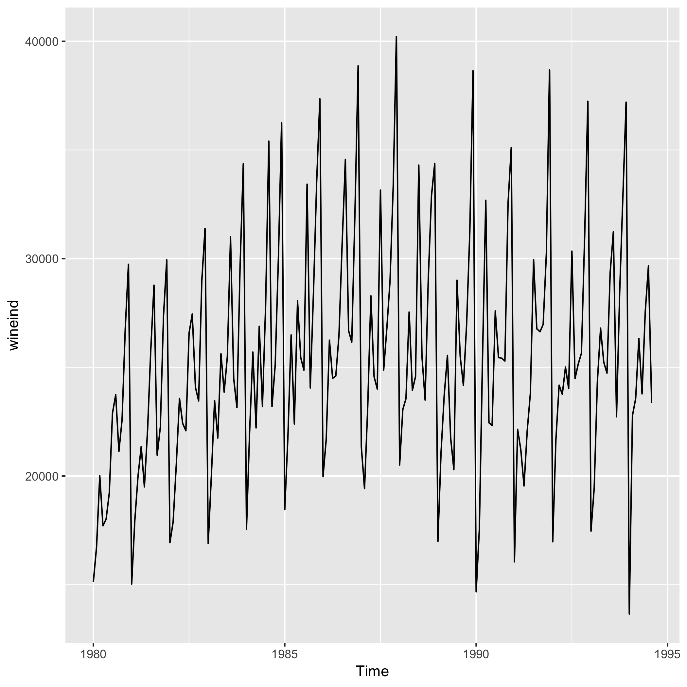
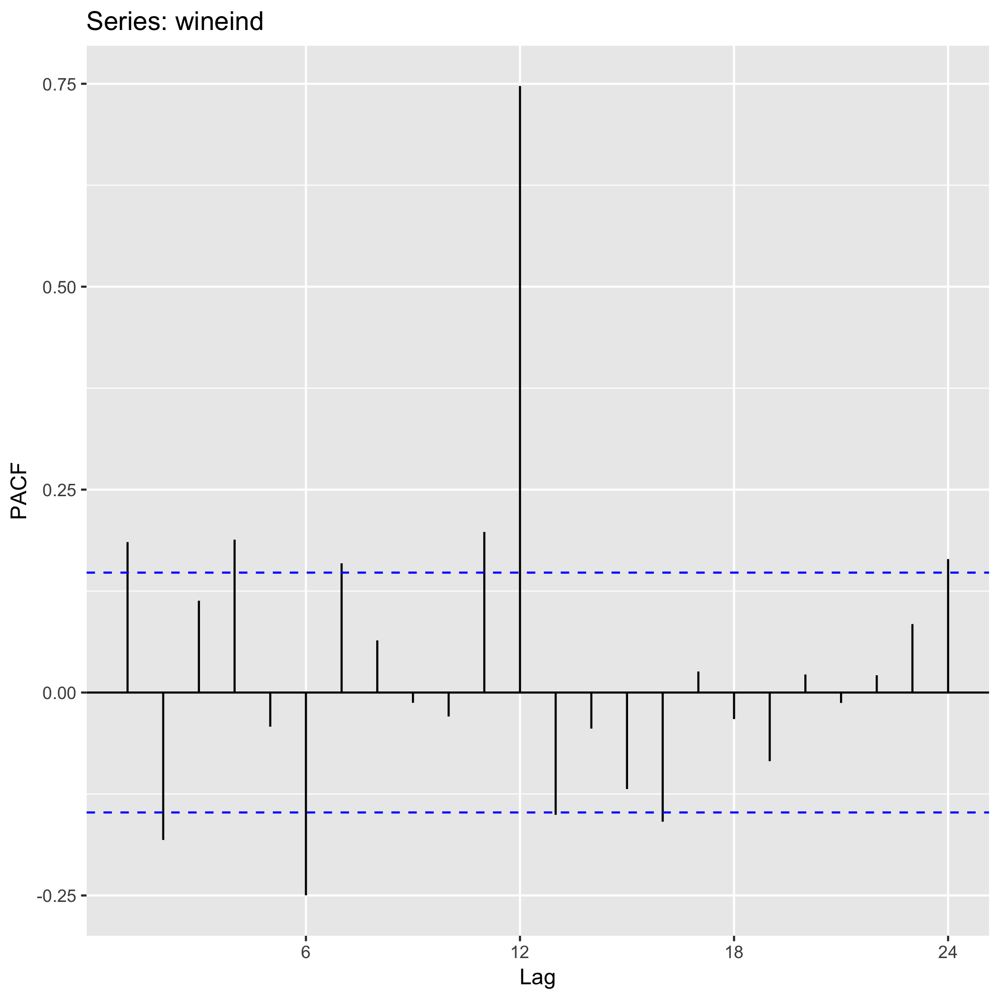

GDAT 510 - Assigment One
================
Chip Galusha
3/19/2019

-   [Introduction](#introduction)
-   [Data](#data)
-   [Visualize The Data](#visualize-the-data)
-   [Possible Applications](#possible-applications)

``` r
save_plot <- function(figure = NULL, file.name = NULL, device = NULL, save.path = NULL, overwrite = FALSE){
  # Advanced saving for md's --------------------------------------------------------
  # 
  #
  # testing:
  # device = "png"
  # save.path = paste0(getwd(),"/figures")
  # file.name = "asgn1_wine_series.png"
  # overwrite = FALSE
  # figure = wine_auto_plot
  
  if(overwrite) {
  
    ggsave(filename = file.name, 
         plot = figure, 
         device = device,
         path = save.path)
      
  } else if(file.exists(paste0(save.path,"/",file.name))) {
    
    print("File already exists.")
    
  } else {
    
    ggsave(filename = file.name, 
         plot = figure, 
         device = device,
         path = save.path)
    
  }
  
}
```

### Introduction

If you've ever attended a party or know my wife, you know I really like non-linear smooth functions (splines) and time series regression modelsdecomposition. For this exercise, I'll be using univariate time series data. This document is broken up into three parts:
- Data: a brief describtion of the data
- Vissualization: the data set in visual form
- Applications: possible application for the data

### Data

``` r
# Make plots and save. Will be called later as they are discussed
wine_auto_plot <- autoplot(wineind)

save_plot(device = "png",
  save.path = paste0(getwd(),"/figures"),
  file.name = "asgn1_wine_series.png",
  overwrite = FALSE,
  figure = wine_auto_plot)
```

    ## [1] "File already exists."

``` r
save_plot(device = "png",
  save.path = paste0(getwd(),"/figures"),
  file.name = "asgn1_wine_series_acf.png",
  overwrite = TRUE,
  figure = ggAcf(wineind))
```

    ## Saving 7 x 5 in image

``` r
save_plot(device = "png",
  save.path = paste0(getwd(),"/figures"),
  file.name = "asgn1_wine_series_pacf.png",
  overwrite = FALSE,
  figure = ggPacf(wineind))
```

    ## [1] "File already exists."

The *wineind* dataset from the *forecast* tracks "Australian total wine sales by wine makers in bottles &lt;= 1 litre. Jan 1980 – Aug 1994."

Visualize The Data
------------------

The series exibits a seasonal patten as well as long term trend. To decompose the series, we use the autoplot function from the forecast package.



Our inital hypothesis that series possesses a seasonal trend is confirmed by the ACF(auto correlation function) which shows spikes as the la 12 & 24 values. Interestinly the lag 6 values also are significantly correlated.


We can use the PACF (partial auto correlation function) to determine the extent to which the correlations propogate.



Possible Applications
---------------------

Not surprisingly, we could use time series regression to forecast future winesales. The mulitple seasonality might require more advanced methods. Fun!
